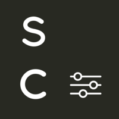
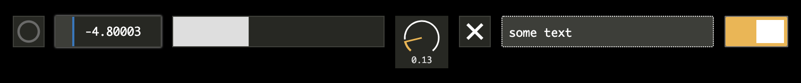

# sc-components

[](https://badge.fury.io/js/@ircam%2Fsc-components)



Simple and robust Web Component library for audio and creative applications in the browser. 



The library is built with [lit](https://lit.dev/).

## Demo and Documentation

[http://ircam-ismm.github.io/sc-components/](http://ircam-ismm.github.io/sc-components/)

## Goal & Philosophy

This is a rather opinionated library, that primarily aims at providing practical and robust interfaces for practitionners in working and performance situations. Hence, it proposes different interaction modalities such as keyboard and MIDI controls where meaningful, and pretty agressively bypasses or overrides certain default browser's behaviours such as context menus, text selection, etc.

## Usage

### With npm and bundlers

Install the library using npm (or yarn, or whatever)

```sh
npm install --save @ircam/sc-components
```

Each components lives in its own file and can be imported separately, e.g.:

```js
import { html, render } from 'lit';
import '@ircam/sc-components/sc-toggle.js';

render(html`
  <sc-toggle
    @change=${e => console.log(e)}
  ></sc-toggle>
`, document.body);
```

For convenience, we also provide a global entry point which imports all components. However, in most cases you should avoid using this shortcut to keep your bundle size as small as possible:

```js
import '@ircam/sc-components';
```

### With unpkg

If you don't use a bundler or for simple testing, you can also use the library from [https://unpkg.com/](https://unpkg.com/).

#### In HTML file

```html
<!DOCTYPE html>
<html>
<head>
  <script type="module" src="https://unpkg.com/@ircam/sc-components@latest"></script>
</head>
<body>
  <sc-toggle></sc-toggle>
  <script>
    const $toggle = document.querySelector('sc-toggle');
    $toggle.addEventListener('change', e => console.log('Hello toggle', e.detail.value));
  </script>
</body>
<body>
```

#### In JS file

```js
import { html, render } from 'https://unpkg.com/lit-html?module';
import 'https://unpkg.com/@ircam/sc-components@latest';

render(html`
  <sc-toggle
    @change=${e => console.log('Hello toggle', e.detail.value)}
  ></sc-toggle>
`, document.body);
```

_Note that this method will import the whole bundled library which is quite large. You may not want to use this is production._

### Integration within other frameworks

The library has not been tested within other frameworks such as React or Vue yet.

Any feedback is welcome!

## Development notes

### Run the doc and tests locally

```sh
npm install
npm run doc
```

Alongside the docs, which already helps in development, the `tests` directory allows to isolate edge-cases that would not fit into the docs.

```sh
npm install
npm run test
```

### Unlock context menu

In development, having the possibility to right-click on an element to inspect it can be quite handy. You can re-enable this behavior by defining the `SC_DEBUG` global variable and setting it to `true`:

```js
window.SC_DEBUG = true;
```

Note that this is the case when the docs and tests are launched locally:

```js
window.SC_DEBUG = window.location.hostname === 'localhost';
````

## Contributing

Contributions from everyone are welcome in the form of suggestions, ideas, bug report, pull requests and feedback.

For PRs, please follow the "fork-and-pull" workflow:

1. __Fork__ the repo on GitHub
2. __Clone__ your fork on your own machine
3. __Commit__ your changes to your own branch
4. __Push__ your work back up to your fork
5. __Submit__ a pull request

<!-- &todos
## Theming and styling
### Global CSS variables
### Styling components
## The sc-* ecosystem
## Contributing
## Credits
-->

## License

[BSD-3-Clause](./LICENSE)
